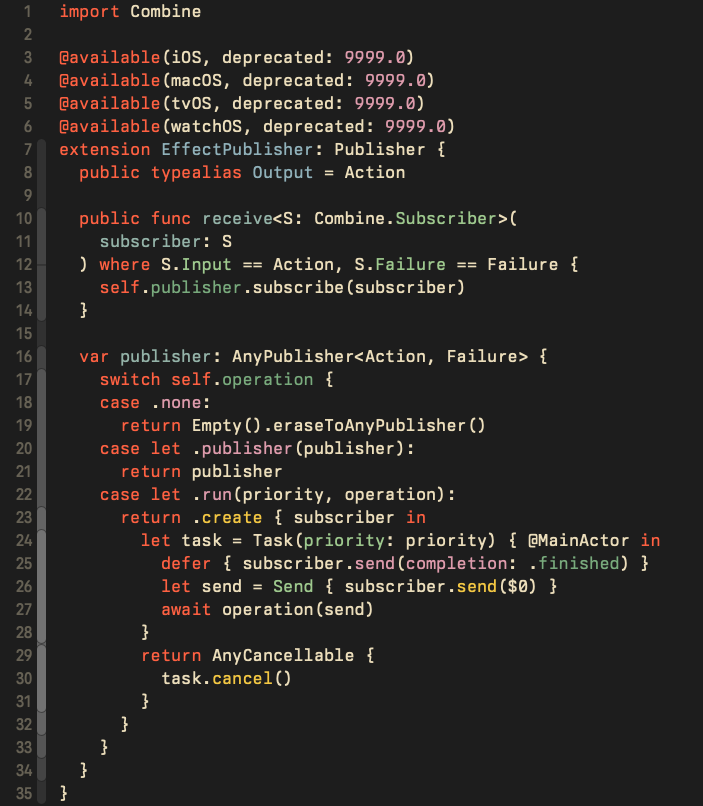
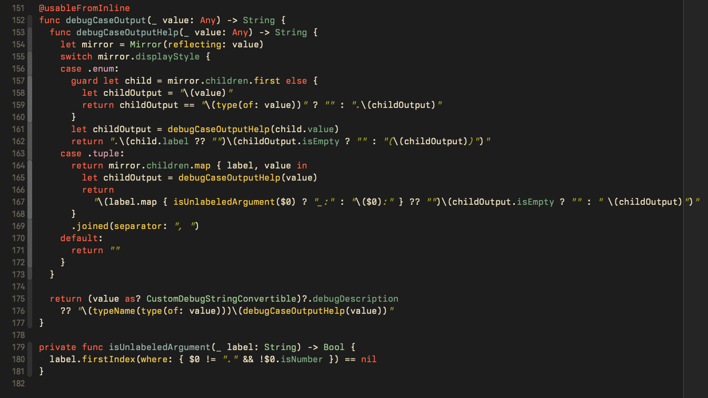

# Gruvbox Baby Xcode Theme

This is my port of Gruvbox Baby theme for Xcode, based on [luisiacc/gruvbox-baby](https://github.com/luisiacc/gruvbox-baby)
Also credit to the og Gruvbox theme [morhetz/gruvbox)(https://github.com/morhetz/gruvbox)

## How to install

1. Download or clone this repo
2. Move `Gruvbox Baby.xccolortheme` to `~/Library/Developer/Xcode/UserData/FontAndColorThemes`
3. Apply Gruvbox Baby theme from Xcode Preferences > Fonts & Colors (You might need to restart Xcode first)

## Screenshots

Font is [Berkeley Mono](https://berkeleygraphics.com/typefaces/berkeley-mono/)

